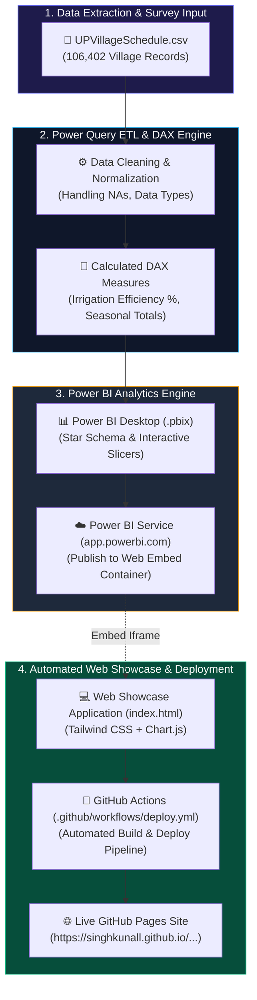

# 🌾 Minor Irrigation & Groundwater Analysis – Uttar Pradesh 💧

<div align="center">


### 🚀 **[Explore Live Interactive Web Showcase](https://singhkunall.github.io/Minor-Irrigation-Analysis-PowerBI/)**

*An end-to-end Data Engineering, Business Intelligence, and Web Showcase project analyzing village-level irrigation infrastructure, crop season dependencies, and groundwater table recharge across **75 districts** and **106,402 villages** in Uttar Pradesh.*

---

</div>

## 📌 Table of Contents
- [Executive Overview](#-executive-overview)
- [System Architecture & Workflow](#-system-architecture--workflow)
- [Key Data Insights & Metrics](#-key-data-insights--metrics)
- [Data Pipeline & Modeling](#-data-pipeline--modeling)
- [Interactive Web Showcase Features](#-interactive-web-showcase-features)
- [Power BI Publishing & Embed Guide](#-power-bi-publishing--embed-guide)
- [Repository File Structure](#-repository-file-structure)
- [Strategic Policy Recommendations](#-strategic-policy-recommendations)

---

## 📖 Executive Overview

Irrigation accessibility and sustainable groundwater management are critical to agricultural productivity in Uttar Pradesh. This project transforms raw government village schedule survey data into visual intelligence using **Microsoft Power BI** and web technologies.

### 📊 Macro Metrics At A Glance:
| Metric | Value | Description |
| :--- | :---: | :--- |
| **Analyzed Districts** | **75** | Complete coverage of Uttar Pradesh districts |
| **Analyzed Villages** | **106,402** | Granular village-level schedules |
| **Total Geographical Area** | **23.60 Million Ha** | Total land area evaluated |
| **Total Cultivable Area** | **17.87 Million Ha** | **75.7%** of total geographical land |
| **Gross Irrigated Area** | **19.10 Million Ha** | Combined seasonal irrigated acreage |
| **Monsoon Groundwater Recharge** | **9.00m → 8.88m** | State-wide avg water table depth recovery |
| **WUA Presence** | **14,058 Villages** | **13.2%** coverage with Water User Associations |

---

## 🏗️ System Architecture & Workflow

The pipeline follows a modern BI workflow: from raw CSV data extraction and Power Query transformation to DAX modeling, Power BI Service publishing, and automated GitHub Pages deployment via GitHub Actions.



---

## 📈 Key Data Insights & Metrics

```mermaid
gantt
    title Seasonal Irrigated Land Distribution (Million Hectares)
    dateFormat  X
    axisFormat %s
    section Rabi Season (41.7%)
    7.96 Million Ha : 0, 796
    section Kharif Season (38.4%)
    7.33 Million Ha : 0, 733
    section Perennial Irrigation (9.8%)
    1.87 Million Ha : 0, 187
    section Other Seasons (10.1%)
    1.94 Million Ha : 0, 194
```



### 🏆 Top 10 Districts by Irrigated Acreage:
1. **Kheri** – `684,101 Ha` *(Kharif: 232K, Rabi: 194K, Perennial: 169K)*
2. **Aligarh** – `515,247 Ha` *(Kharif: 215K, Rabi: 248K, Perennial: 3.4K)*
3. **Bareilly** – `504,062 Ha` *(Kharif: 187K, Rabi: 184K, Perennial: 73K)*
4. **Shahjahanpur** – `492,608 Ha` *(Kharif: 195K, Rabi: 196K, Perennial: 61K)*
5. **Hardoi** – `475,179 Ha` *(Kharif: 142K, Rabi: 197K, Perennial: 75K)*
6. **Sitapur** – `471,588 Ha` *(Kharif: 163K, Rabi: 154K, Perennial: 73K)*
7. **Barabanki** – `426,742 Ha` *(Kharif: 151K, Rabi: 154K, Perennial: 41K)*
8. **Jaunpur** – `414,377 Ha` *(Kharif: 181K, Rabi: 191K, Perennial: 20K)*
9. **Firozabad** – `411,544 Ha` *(Kharif: 146K, Rabi: 171K, Perennial: 16K)*
10. **Prayagraj** – `401,803 Ha` *(Kharif: 166K, Rabi: 179K, Perennial: 16K)*

---

## 🛠️ Data Pipeline & DAX Modeling

### Power Query Transformation Steps:
1. **Header & Type Standardisation**: Trimmed text columns, removed null records, and converted numerical strings to integer/decimal formats.
2. **Missing Value Imputation**: Replaced `NA` strings with `0` for area fields to prevent DAX calculation errors.
3. **Geography Key Mapping**: Established hierarchical relationships (`District` ➔ `Block/Tehsil` ➔ `Village`).

### Core DAX Formulas:

```dax
// Total Gross Irrigated Area Across All Seasons
Total_Gross_Irrigated_Area = 
    SUM(UPVillageSchedule[gross_irrigated_area_total])

// Irrigation Efficiency Percentage
Irrigation_Efficiency_Pct = 
    DIVIDE(
        SUM(UPVillageSchedule[net_irrigated_area]), 
        SUM(UPVillageSchedule[cultivable_area]), 
        0
    ) * 100

// Average Groundwater Level Recovery (Monsoon Recharge)
Groundwater_Recharge_Depth_Meters = 
    AVERAGE(UPVillageSchedule[avg_ground_water_level_pre_monsoon]) - 
    AVERAGE(UPVillageSchedule[avg_ground_water_level_post_monsoon])
```

---

## 💻 Interactive Web Showcase Features

The project includes a web showcase (`index.html`) deployed on GitHub Pages:

- 📺 **Power BI Embed Viewport**: Live iframe streaming with full-screen toggle and modal link configuration.
- 📊 **Dynamic Web Analytics**: Interactive **Chart.js** visuals for Top Districts, Seasonal Shares, Groundwater Shifts, and WUA Governance.
- 📚 **In-App Report Reader**: Tabbed documentation viewer for `FinalPowerBIreport.pdf` & `.doc`.
- 📥 **Asset Download Hub**: One-click direct downloads for `.pbix`, `.csv`, `.pdf`, and `.doc` files.

---

## ☁️ Power BI Publishing & Embed Guide

To connect your live Power BI report to the deployed site:

```
[Power BI Desktop] ➔ Home ➔ Publish ➔ Select Workspace
       │
       ▼
[Power BI Service (app.powerbi.com)] ➔ Open Report ➔ File ➔ Embed Report ➔ Publish to Web (Public)
       │
       ▼
[Copy iframe URL] ➔ Open Web Showcase ➔ Click "+ Enter Power BI Embed Link" ➔ Apply
```

---

## 📁 Repository File Structure

```micro
Minor-Irrigation-Analysis-PowerBI/
├── index.html                   # 🌐 Responsive Web Showcase & Interactive Viewer
├── powerBIFinalProject.pbix     # 📊 Power BI Desktop Source Report
├── UPVillageSchedule.csv        # 🗃️ Survey Dataset (106,402 Village Records)
├── FinalPowerBIreport.pdf       # 📄 Compiled Project Analysis Report (PDF)
├── FinalPowerBIreport.doc       # 📝 Project Documentation (Word Format)
├── README.md                    # 📖 Project Architecture & Documentation
├── .gitignore                   # 🚫 Git Exclusions
└── .github/
    └── workflows/
        └── deploy.yml           # 🤖 Automated GitHub Pages Deployment Workflow
```

---

## 💡 Strategic Policy Recommendations

1. **Focus on Rabi Season Efficiency**: Expand surface-water canal networks in tube-well dependent districts like Aligarh and Firozabad to reduce groundwater over-extraction.
2. **WUA Capacity Expansion**: Currently, only **13.2%** of villages possess active Water User Associations. Establishing WUAs in remaining villages will encourage participatory water budgeting.
3. **Deep Water Table Recharging**: Districts like Prayagraj (pre-monsoon water depth 20.2m) require priority funding for rainwater harvesting structures and percolation ponds.

---

<div align="center">

### 👨‍💻 Developed by **[Kunal Singh](https://github.com/Singhkunall)**
*If you find this project helpful, feel free to give it a ⭐ on GitHub!*

</div>
